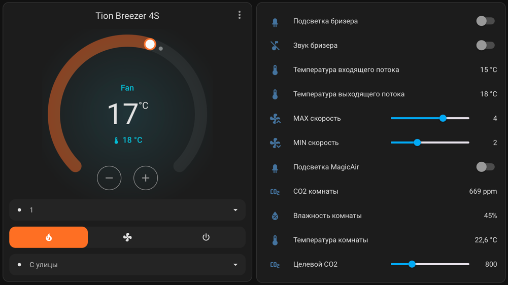

# Tion Home Assistant

[](https://github.com/vaproloff/tion_home_assistant/actions/workflows/hacs.yaml)
[](https://github.com/vaproloff/tion_home_assistant/actions/workflows/hassfest.yaml)


Интеграция оборудования Tion в Home Assistant через облачный API Tion.

Она добавляет управление бризерами Tion Breezer 3S/4S, станцией MagicAir и модулем CO2+, а также датчики температуры, CO2, влажности, PM2.5 и состояния фильтров.

> Для работы интеграции нужен аккаунт Tion и станция/шлюз MagicAir, через которую устройства доступны в облаке Tion.



## Возможности

- Управление бризером как `climate`: включение, выключение, нагрев, скорость вентилятора и источник воздушного потока.
- Датчики температуры входящего и выходящего потока воздуха.
- Управление подогревом, подсветкой и звуковыми сигналами.
- Настройка минимальной и максимальной скорости для Авто режима.
- Дата следующей замены фильтров, индикатор необходимости замены и кнопка сброса периода замены.
- Датчики MagicAir/CO2+: температура, влажность, CO2, PM2.5 и целевой уровень CO2.

## Требования

- Home Assistant 2025.1 или новее.
- Аккаунт Tion.
- Станция/шлюз Tion MagicAir.
- HACS для рекомендуемой установки.

## Поддерживаемые устройства

- Tion Breezer 3S
- Tion Breezer 4S
- Tion MagicAir
- Tion Module CO2+

## Установка

### HACS

Рекомендуемый способ установки: HACS позволит получать обновления интеграции обычным способом.

1. Откройте `HACS` -> `...` -> `Пользовательские репозитории`.
2. Добавьте репозиторий `vaproloff/tion_home_assistant`.
3. Выберите тип `Интеграция` и нажмите `Добавить`.
4. Найдите `Tion` в HACS и установите интеграцию.
5. Перезагрузите Home Assistant.

### Вручную

1. Скачайте архив репозитория.
2. Скопируйте каталог `custom_components/tion` в `config/custom_components/tion`.
3. Перезагрузите Home Assistant.

## Настройка

1. Откройте `Настройки` -> `Устройства и службы`.
2. Нажмите `Добавить интеграцию`.
3. Найдите `Tion`.
4. Введите логин и пароль от аккаунта Tion.

## Сущности

### Бризеры Tion

- `climate` - управление бризером:
  - `hvac_mode`: `heat`, `fan_only`, `off`;
  - `fan_mode`: `1`-`6`, `auto`;
  - `swing_mode`: `outside`, `inside`, `mixed`;
  - уставка температуры подогрева.
- `sensor` - температура входящего потока воздуха.
- `sensor` - температура выходящего потока воздуха.
- `sensor` - дата и время следующей замены фильтров.
- `binary_sensor` - необходимость замены фильтров.
- `button` - сброс периода замены фильтров.
- `switch` - подогрев воздуха.
- `switch` - подсветка кнопки.
- `switch` - звуковые сигналы.
- `number` - минимальная скорость для Авто режима.
- `number` - максимальная скорость для Авто режима.

### MagicAir и Module CO2+

- `sensor` - температура.
- `sensor` - влажность.
- `sensor` - уровень CO2.
- `sensor` - качество воздуха PM2.5, если датчик доступен.
- `number` - целевой уровень CO2 для Авто режима.
- `switch` - подсветка.

## Управление

Интеграция использует стандартные сервисы Home Assistant:

- `climate.turn_on` и `climate.turn_off` - включение и выключение бризера.
- `climate.set_temperature` - установка температуры подогрева.
- `climate.set_fan_mode` - установка скорости вентилятора или Авто режима.
- `climate.set_hvac_mode` - выбор режима `heat`, `fan_only` или `off`.
- `climate.set_swing_mode` - выбор источника воздушного потока.
- `number.set_value` - настройка целевого CO2 и скоростей Авто режима.
- `switch.turn_on`, `switch.turn_off`, `switch.toggle` - управление подогревом, подсветкой и звуком.
- `button.press` - сброс периода замены фильтров через кнопку `button.<device>_reset_filters`.

## Если что-то не работает

1. Убедитесь, что станция MagicAir подключена к аккаунту Tion и устройства видны в официальном приложении.
2. Если интеграция не появилась в списке после установки, перезагрузите Home Assistant и очистите кэш браузера.
3. Включите debug-логирование:

    ```yaml
    logger:
      default: info
      logs:
        custom_components.tion: debug
    ```

4. Создайте issue и приложите описание проблемы вместе с логами: https://github.com/vaproloff/tion_home_assistant/issues/new
