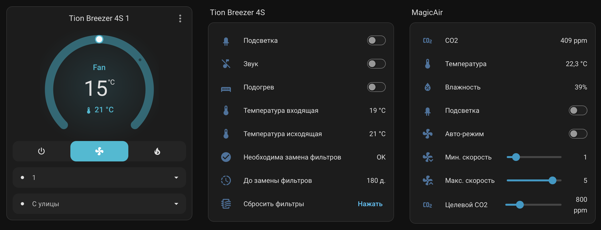

# Tion Home Assistant

[](https://github.com/vaproloff/tion_home_assistant/actions/workflows/hacs.yaml)
[](https://github.com/vaproloff/tion_home_assistant/actions/workflows/hassfest.yaml)


[](https://github.com/vaproloff/tion_home_assistant/stargazers)

Интеграция добавляет управление устройствами Tion в Home Assistant через облако Tion MagicAir.

> **С версии 2026.10 интеграция работает только с новым облаком Tion.** Аккаунт должен быть перенесён в приложении Tion MagicAir. Как обновиться со старой версии — в разделе [«Обновление с 2026.6.x»](#обновление-с-20266x).

> Если понравилась интеграция - буду рад вашей отметке ⭐️ на Github!



## English summary

A custom Home Assistant integration for Tion Breezer O2/3S/4S, MagicAir and Module CO2+. Since 2026.10 it works with the new Tion cloud only: the account must be moved to it in the Tion MagicAir app first. Sign-in takes the e-mail and password, a captcha and a code sent by e-mail; device state arrives by push. The integration offers manual and local PID speed presets per breezer and a local CO2 PID fan mode driven by any Home Assistant CO2 sensor. Updating from 2026.6.x keeps devices, entity IDs and settings after signing in again.

## Что умеет интеграция

- Управлять бризерами: включать, выключать, выбирать скорость, режим (вентиляция или нагрев) и температуру нагрева.
- Переключать забор воздуха: с улицы, из комнаты или смешанный, если модель это поддерживает.
- Показывать температуру входящего и исходящего потока.
- Показывать CO2, влажность, температуру и PM2.5 со станций MagicAir и модулей CO2+.
- Включать авторежим комнаты, задавать целевой CO2 и пределы скорости авторежима.
- Держать CO2 по любому датчику Home Assistant локальным PID-регулятором (режим вентилятора «PID»).
- Переключать пресеты скорости: ручные (фиксированная скорость) и PID (свои пределы скорости).
- Управлять подогревом, подсветкой и звуковыми сигналами.
- Напоминать о замене фильтров и сбрасывать счётчик после замены.

## Поддерживаемые устройства

- Tion Breezer 4S
- Tion Breezer 3S
- Tion Breezer O2
- Tion MagicAir
- Tion Module CO2+

## Требования

- Home Assistant 2026.1 или новее.
- Аккаунт Tion, перенесённый в новое облако в приложении Tion MagicAir, и станция MagicAir, через которую устройства на связи.
- Постоянный пароль аккаунта. Если вы входили в приложение только по коду, задайте пароль в приложении.

## Установка

### HACS

Рекомендуемый способ установки - через HACS. Так Home Assistant будет видеть обновления интеграции обычным способом.

1. Откройте `HACS` -> `...` -> `Пользовательские репозитории`.
2. Добавьте репозиторий `https://github.com/vaproloff/tion_home_assistant`.
3. Выберите тип `Интеграция` и нажмите `Добавить`.
4. Найдите `Tion` в HACS и установите интеграцию.
5. Перезапустите Home Assistant.

### Вручную

1. Скачайте архив репозитория.
2. Скопируйте каталог `custom_components/tion` в `config/custom_components/tion`.
3. Перезапустите Home Assistant.

## Настройка

1. Откройте `Настройки` -> `Устройства и службы`.
2. Нажмите `Добавить интеграцию` и найдите `Tion`.
3. Введите email и пароль аккаунта Tion.
4. Пройдите капчу на открывшейся странице.
5. Введите код из письма, которое пришлёт Tion.

После входа интеграция сама найдёт устройства аккаунта. Если сессия Tion закончится (она длится не больше 30 дней), Home Assistant попросит войти заново.

## Обновление с 2026.6.x

Старое облако Tion закрывается, и прежние версии интеграции перестают работать.

1. Перенесите аккаунт в приложении Tion MagicAir.
2. Обновите интеграцию в HACS и перезапустите Home Assistant.
3. Home Assistant попросит войти в Tion заново: откройте уведомление о повторной авторизации и пройдите вход (пароль, капча, код из письма). **Не удаляйте интеграцию и не добавляйте её заново** — иначе сущности получат новые entity_id.

Если обновиться раньше переноса, интеграция покажет уведомление в разделе `Настройки` -> `Исправления`. После переноса перезагрузите интеграцию или перезапустите Home Assistant.

После входа интеграция сама сопоставит устройства с новым облаком по MAC-адресу. Сохраняются:

- устройства, их комнаты и имена;
- entity_id, имена и история сущностей, а значит автоматизации и дашборды;
- настройки локального PID и ручные пресеты.

Что меняется:

- Авто-пресетов больше нет. На бризере с настроенным PID они становятся PID-пресетами с теми же пределами скорости, на остальных удаляются.
- Пределы скорости PID берутся из авторежима комнаты (их и использовал прежний PID), целевой CO2 PID — 800 ppm. Поправьте их числами на бризере.
- Пределы скорости авторежима теперь на станции MagicAir или модуле CO2+ комнаты, а не на бризере. На бризере без PID прежние числа пределов удаляются.
- Интервал обновления (`scan_interval`) больше не настраивается: состояние приходит сразу.
- Сенсор активного профиля API удалён.
- У Breezer 3S нет переключателей подсветки и звука: новое облако их не поддерживает. Прежние сущности можно удалить вручную.
- Активный пресет бризера после обновления не восстанавливается — выберите его заново.

Для Breezer 3S, Breezer O2 и Module CO2+ перенос вживую не проверялся. Если после обновления появились дубли сущностей с `_2`, создайте issue и приложите debug-лог.

## Что появится в Home Assistant

| Устройство | Сущности |
| --- | --- |
| Бризер | `climate` — включение, режим (вентиляция или нагрев), температура, режим вентилятора, забор воздуха, пресеты |
| | `sensor` — температура входящего и исходящего потока, дни до замены фильтров |
| | `binary_sensor` — фильтры требуют замены (и уведомление) |
| | `button` — сброс счётчика фильтров |
| | `switch` — подогрев воздуха (если есть нагреватель), подсветка и звук (если модель поддерживает) |
| | `number` — минимальная и максимальная скорость PID, целевой CO2 PID (только при настроенном PID) |
| Станция MagicAir, модуль CO2+ | `sensor` — температура, влажность, CO2, PM2.5 (если есть датчик) |
| | `switch` — подсветка; авторежим комнаты (MagicAir в комнате) |
| | `number` — целевой CO2, минимальная и максимальная скорость авторежима (станция в комнате) |

Интеграция использует стандартные действия Home Assistant, поэтому её можно подключать к автоматизациям, скриптам, дашбордам и голосовым сценариям без отдельных сервисов.

## Режимы вентилятора

Режим вентилятора бризера (`fan_mode` в `climate`):

- `1`…`6` (до максимума модели) — ручная скорость. Выключает авторежим комнаты и PID.
- `auto` — авторежим комнаты в облаке Tion: скорость по CO2 станции MagicAir в пределах скорости авторежима. Есть, если бризер в комнате.
- `PID` — локальный PID по выбранному датчику CO2. Есть, если на бризере настроен PID.

Авторежим общий на комнату: включение на одном бризере включает его для всей комнаты. Выключение бризера в Home Assistant выключает авторежим комнаты и PID.

## Пресеты скорости

Пресет переключается одним выбором в карточке бризера. Имена — из стандартного списка Home Assistant (`Эко`, `Нет дома`, `Турбо`, `Комфорт`, `Сон`, `Активность`, `Дома`); набор настраивается для каждого бризера отдельно.

- **Ручной** — фиксированная скорость. Включает бризер, если он выключен.
- **PID** — локальный PID со своими пределами скорости. Доступен, если на бризере настроен PID.

Как они работают:

- При выборе пресета интеграция запоминает текущий режим (скорость или PID), а `Без пресета` возвращает его. Облачный авторежим при этом не включается.
- Если сменить режим в обход пресета (другая скорость, другой режим вентилятора, выключение, приложение Tion), пресет снимается без возврата.
- Активный пресет переживает перезапуск Home Assistant.

### Настройка пресетов

1. Откройте `Настройки` -> `Устройства и службы` -> `Tion` -> `Настроить`.
2. Выберите `Настроить пресеты`. Если бризеров несколько — выберите бризер.
3. В меню бризера выберите `Добавить пресет`, `Изменить пресет` или `Удалить пресет`. В меню только действия, которые сейчас можно выполнить.
4. Вернитесь `Назад` и нажмите `Сохранить` в главном меню. Изменения применяются только после `Сохранить`, интеграция при этом перезагрузится.

Минимальная скорость PID-пресета не может быть больше максимальной. Тип пресета при правке не меняется: чтобы сменить тип, удалите пресет и создайте заново.

## Локальный PID по датчику CO2

Авторежим Tion выбирает скорость в облаке по CO2 станции MagicAir. Локальный PID нужен, чтобы держать CO2 по другому датчику Home Assistant (например, в другой точке комнаты): интеграция сама считает скорость бризера и отправляет её в облако, только когда она меняется.

### Настройка PID

1. Откройте `Настройки` -> `Устройства и службы` -> `Tion` -> `Настроить`.
2. Выберите `Настройка локального PID-контроллера`. Если бризеров несколько — выберите бризер.
3. В меню бризера выберите `Настроить PID`: включите локальное управление CO2, выберите датчик CO2 и при необходимости поменяйте параметры.
4. Вернитесь `Назад` и нажмите `Сохранить` в главном меню.

`Удалить PID` удаляет все настройки PID бризера, включая пределы и цель. Чтобы временно отключить PID без потери настроек, снимите галочку `Включить локальное управление CO2`.

После настройки у бризера появляются режим вентилятора `PID`, PID-пресеты и три числа: минимальная и максимальная скорость PID и целевой CO2 PID. Эти числа хранятся в Home Assistant, в облако не уходят и доступны всегда.

### Как работает PID

- PID пересчитывает скорость раз в `Интервал PID` (по умолчанию 60 с) и отправляет команду, только если скорость изменилась.
- PID сам включает выключенный бризер, когда CO2 растёт, и выключает его при скорости 0 (если минимальная скорость PID — 0). Если бризер выключился сам или из приложения (например, при замене фильтров), PID включит его снова.
- Выключение бризера в Home Assistant, выбор скорости или режима `auto` останавливает PID.
- Если в комнате включили авторежим (в приложении или переключателем станции), PID уступает ему и останавливается.
- Пока датчик недоступен или бризер не на связи, PID ждёт. Состояние видно в атрибутах `pid_active` и `pid_status` климата.

### Параметры PID

- `Внешний датчик CO2` — сенсор CO2 в ppm.
- `Интервал PID` — как часто PID пересчитывает скорость, 10–600 с. По умолчанию 60.
- `Базовая мощность PID` — мощность в процентах до PID-коррекции. По умолчанию 20 %.
- `Пропорциональный коэффициент PID` (`kp`) — реакция на текущее отклонение CO2. По умолчанию 0.5.
- `Интегральный коэффициент PID` (`ki`) — накопление долгого отклонения. По умолчанию 0.001; менять стоит, только если вы настраиваете PID осознанно.
- `Дифференциальный коэффициент PID` (`kd`) — реакция на быстрое изменение CO2. По умолчанию 0; датчики CO2 шумят, обычно лучше оставить 0.

PID считает мощность 0–100 %, переводит её в скорость относительно максимальной скорости бризера и ограничивает пределами PID. Базовая мощность не даёт бризеру остановиться около цели; если CO2 ниже цели, отрицательное отклонение снижает мощность до минимума или до выключения.

## Если что-то не работает

Сначала проверьте простые вещи:

1. Аккаунт перенесён в новое облако, устройства видны в приложении Tion MagicAir.
2. Станция MagicAir онлайн.
3. После установки или обновления Home Assistant был перезапущен.
4. В разделе `Настройки` -> `Исправления` нет уведомления от Tion.

Для диагностики можно включить debug-логирование:

```yaml
logger:
  default: info
  logs:
    custom_components.tion: debug
```

Если проблема повторяется, создайте issue и приложите описание ситуации вместе с логами: https://github.com/vaproloff/tion_home_assistant/issues/new

## Техническая информация

- Вход в облако Tion MagicAir по gRPC-Web с капчей и кодом из письма; сессия обновляется сама.
- Состояние устройств приходит по живому каналу облака (NATS поверх WebSocket); раз в минуту интеграция для страховки перечитывает структуру аккаунта.
- Свой минимальный клиент протокола без сторонних зависимостей.
- Нативные платформы Home Assistant: `climate`, `sensor`, `binary_sensor`, `button`, `number`, `switch`.
- Локальный PID-регулятор CO2 работает внутри Home Assistant по своему таймеру.
- Локализация на русском и английском, HACS metadata, Hassfest и HACS validation в GitHub Actions.

Интеграция работает через облако Tion (`cloud_push`); прямого локального управления устройствами нет.
